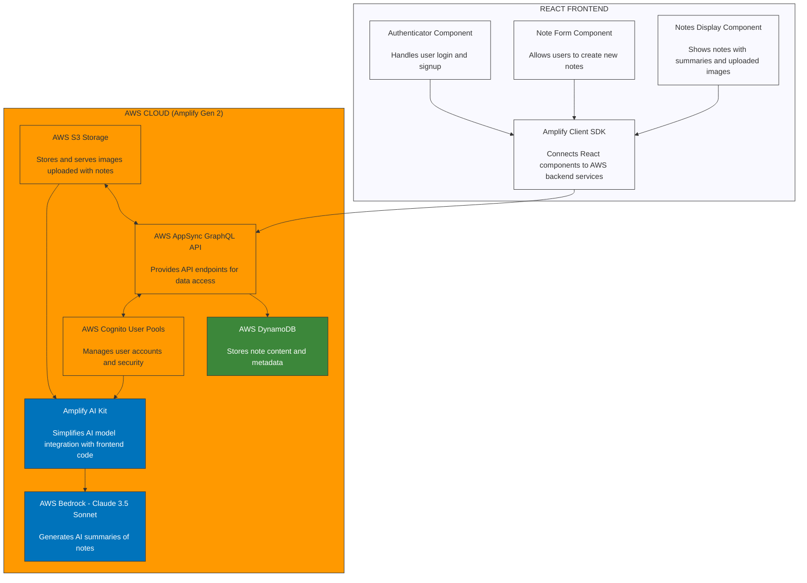

# React AI Full Stack App

A modern React application that uses AWS Amplify Gen 2 for backend services and AWS Bedrock for AI capabilities. This app allows users to create, view, and manage notes with images, and generate AI summaries of note content using Claude 3.5 Sonnet.

## Architecture

### Architecture Diagram

The following diagram illustrates the application architecture:



### ASCII Diagram (Alternative View)

```
┌─────────────────────────────────────────────────────────────────────────┐
│                           REACT FRONTEND                                │
│                                                                         │
│  ┌───────────────┐    ┌───────────────┐    ┌───────────────────────┐    │
│  │ Authenticator │    │   Note Form   │    │     Notes Display     │    │
│  │  Component    │    │  Component    │    │      Component        │    │
│  │               │    │               │    │                       │    │
│  │ "Handles user │    │ "Allows users │    │ "Shows notes with     │    │
│  │  login and    │    │  to create    │    │  summaries and        │    │
│  │  signup"      │    │  new notes"   │    │  uploaded images"     │    │
│  └───────┬───────┘    └───────┬───────┘    └───────────┬───────────┘    │
│          │                    │                        │                │
│          │                    │                        │                │
│          ▼                    ▼                        ▼                │
│  ┌─────────────────────────────────────────────────────────────────┐    │
│  │                     Amplify Client SDK                          │    │
│  │                                                                 │    │
│  │     "Connects React components to AWS backend services"         │    │
│  └─────────────────────────────┬───────────────────────────────────┘    │
│                                │                                        │
└────────────────────────────────┼────────────────────────────────────────┘
                                 │
                                 ▼
┌─────────────────────────────────────────────────────────────────────────┐
│                      AWS CLOUD (Amplify Gen 2)                          │
│                                                                         │
│  ┌───────────────┐    ┌───────────────┐    ┌───────────────────────┐    │
│  │ AWS Cognito   │    │  AWS AppSync  │    │     AWS S3            │    │
│  │ User Pools    │◄───┤  GraphQL API  │◄───┤     Storage           │    │
│  │               │    │               │    │                       │    │
│  │ "Manages user │    │ "Provides API │    │ "Stores and serves    │    │
│  │  accounts and │    │  endpoints for│    │  images uploaded      │    │
│  │  security"    │    │  data access" │    │  with notes"          │    │
│  └───────┬───────┘    └───────┬───────┘    └───────────┬───────────┘    │
│          │                    │                        │                │
│          │                    │                        │                │
│          │                    ▼                        │                │
│          │            ┌───────────────┐                │                │
│          │            │  AWS DynamoDB │                │                │
│          │            │  (Note Data)  │                │                │
│          │            │               │                │                │
│          │            │ "Stores note  │                │                │
│          │            │  content and  │                │                │
│          │            │  metadata"    │                │                │
│          │            └───────────────┘                │                │
│          │                                             │                │
│          │            ┌───────────────────────┐        │                │
│          │            │   Amplify AI Kit      │        │                │
│          │            │                       │        │                │
│          │            │ "Simplifies AI model  │        │                │
│          └───────────►│  integration with     │◄───────┘                │
│                       │  frontend code"       │                         │
│                       └──────────┬────────────┘                         │
│                                  │                                      │
│                                  ▼                                      │
│                       ┌───────────────────────┐                         │
│                       │     AWS Bedrock       │                         │
│                       │  Claude 3.5 Sonnet    │                         │
│                       │                       │                         │
│                       │ "Generates AI         │                         │
│                       │  summaries of notes"  │                         │
│                       └───────────────────────┘                         │
│                                                                         │
└─────────────────────────────────────────────────────────────────────────┘
```

## Features

- **User Authentication**: Secure login and signup using AWS Cognito
- **Note Management**: Create, view, and delete notes
- **Image Upload**: Attach images to notes, stored in S3
- **AI Summaries**: Generate comedic summaries of note content using Claude 3.5 Sonnet
- **Responsive UI**: Built with Amplify UI React components

## Technical Stack

- **Frontend**: React 19 with Amplify UI components
- **Backend**: AWS Amplify Gen 2 (TypeScript-based IaC)
- **Authentication**: AWS Cognito User Pools
- **Data Storage**: AWS DynamoDB with AppSync GraphQL API
- **File Storage**: AWS S3
- **AI Integration**: AWS Bedrock via Amplify AI Kit

## Key Components

### Frontend

The React application provides an intuitive interface for managing notes and generating AI summaries:

- **Authentication Flow**: Secure login/signup with Amplify Authenticator
- **Note Creation**: Form for creating notes with optional image uploads
- **Note Display**: Grid layout showing notes with their descriptions and images
- **AI Integration**: "Summarize" button to generate AI summaries of note content

### Backend (Amplify Gen 2)

The backend is built using AWS Amplify Gen 2's declarative approach:

- **Data Model**: Defines a Note schema with name, description, and image fields
- **Authorization**: Owner-based access control for notes
- **AI Generation**: Configured AI generation endpoint using Claude 3.5 Sonnet
- **Storage**: S3 configuration for image uploads and retrieval

### AI Integration

The app leverages AWS Bedrock for AI capabilities:

- **Claude 3.5 Sonnet**: Foundation model for generating summaries
- **Amplify AI Kit**: Simplifies integration between React and Bedrock
- **System Prompt**: Configured to generate summaries in a comedy style

## Getting Started

1. Clone the repository
2. Install dependencies: `npm install`
3. Start the development server: `npm run dev`
4. For backend development: `npx ampx sandbox`

## Development Notes

- The app uses Amplify Gen 2's TypeScript-based infrastructure as code
- AI generation is configured in `amplify/data/resource.ts`
- Authentication is set up for email-based login
- Images are stored in user-specific S3 paths for security